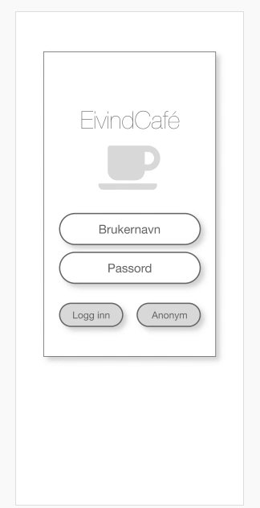
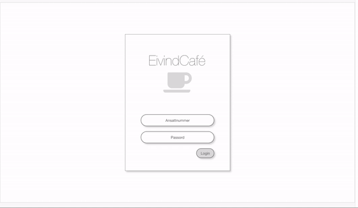

# Group 24
Semester task - DS3801 Grensesnittdesign, in Kristiania University College. 

!!!LEGG INN GIF AV FERDIG PROSJEKT HER!!!

## Table of contents
1. [Quick start. ](#start)
2. [About. ](#about)
3. [Concept. ](#concept)

## Quick start:
* Clone the repositiry to your local machine. 
* Open the folder where you saved the repository.
* For the app, open LoginPage.html
* For the cash register system, open HomePage.html

## About the project:
* The project started 07.09.2020 and lasted to 09.11.2020.
* We are three students collaborating on this exam project. 
* In this assignment, we will create a cash register system for employees and an app for customers in Eivind's café. The solution we create will be intuitive, efficient and simple to understand and use. 
* The target group is students, because they often but coffee on the go, work in cafes and use cafes when they study. Therefore, we have tried to get a stylish and consistent design. But ff course we want the solution to be used by everyone, so the main focus is simplicity.
* We strive to meet the users expectations and needs, as quickly and dependably as possible.
* In the app, which will primarily be used on mobilephones, customers can order certain products or an order that contains several different products. The user can also see an overview of the total price of an order, be able to add more than one item to their order, remove items from the order and see an overview of previous orders. 
* In the cash register system, which is not primarily on the phone, the employee can choose which employee is logged in, complete orders and see an overview of previous orders. They can also see orders coming from the customers app and tap that it is complete when done.
* Saving information in Local Storage.

## Concept: 
* Through qualitative interviews, we came to the conclusion that it is important for the user that the solution is easy to use, easily accessible, it must be aesthetically pleasing and they must receive good information about the actions they do. This was what we had in mind when we made thread sketches and flow charts, and at last the clickable, finished prototype of what the finished product should look like.
* The clickable finished prototype is clear, intuitive and easy to use as you can see for yourself below. 

### App prototype:
 

### Cash register system prototype: 

